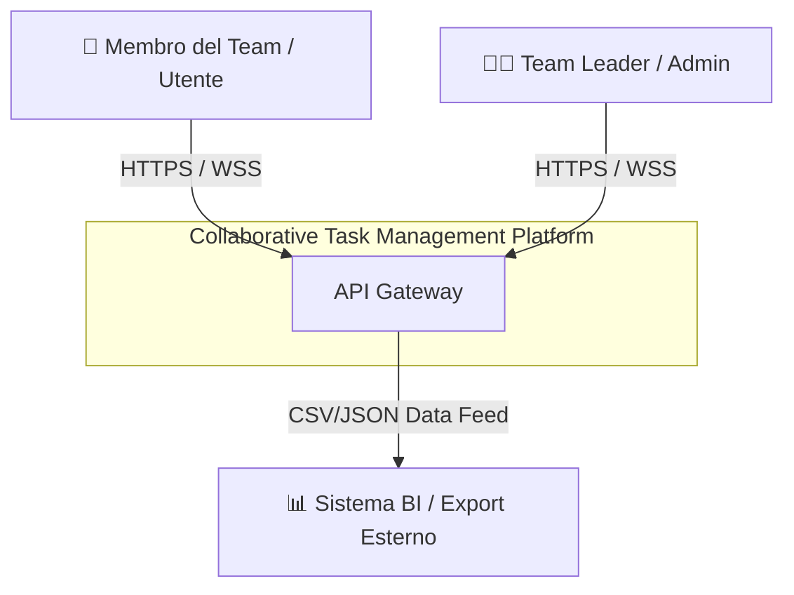
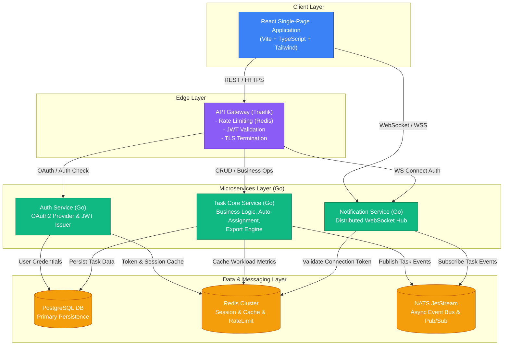

# Documento di Progettazione Architetturale Dettagliata
## Sistema Collaborativo di Task Management in Tempo Reale

---

## 1. Panoramica del Sistema e Obiettivi Architetturali

Il sistema è una piattaforma cloud-native per la gestione collaborativa dei task, progettata per garantire elevata concorrenza, reattività in tempo reale e portabilità su qualsiasi cloud provider managed Kubernetes (AWS EKS, GCP GKE, Azure AKS).

### 1.1 Requisiti Funzionali Chiave
- **Gestione Task Collaborativa**: Creazione, aggiornamento, tracciamento stato dei task con supporto a modifiche concorrenti.
- **Assegnazione Automatica Basata sul Carico**: Algoritmo euristico per l'assegnazione automatica dei task basata sul carico di lavoro pesato degli sviluppatori.
- **Notifiche in Tempo Reale**: Invio istantaneo di aggiornamenti tramite connessioni WebSocket persistenti.
- **Export Dati Strutturato**: Generazione asincrona e streaming di report in formato JSON e CSV.

### 1.2 Requisiti Non Funzionali e SLA
- **Capacità Concorrente**: Supporto garantito a 100+ utenti attivi simultaneamente con latenza ridotta (< 100ms API, < 20ms WebSocket).
- **Uptime Target**: SLA 99.5% su base mensile.
- **Portabilità Cloud**: Definizione Infrastruttura-come-Codice (IaC) con Terraform e Kubernetes.
- **Consistenza e Gestione Conflitti**: Lock ottimistico con controllo di versione sugli aggiornamenti dei task.

---

## 2. Architettura C4 (Context & Containers)

### 2.1 C4 Level 1 - System Context



### 2.2 C4 Level 2 - Container Diagram



---

## 3. Specifica Dettagliata dei Servizi

### 3.1 API Gateway
- **TLS Termination**: HTTPS / WSS.
- **Auth Interceptor**: Valida i token JWT nell'header `Authorization: Bearer <JWT>`.
- **Rate Limiting**: Algoritmo Token Bucket backed da Redis (max 100 req/min per utente).
- **Dynamic Routing**: Smista le richieste ai microservizi corretti in base al path URL.

### 3.2 Servizio di Autenticazione (OAuth2)
- Provider OAuth2 con supporto a **Access Token** (JWT, 15 min) e **Refresh Token** (Redis, 7 giorni).
- Gestione sessioni e blacklist per disconnessione immediata tramite Redis.

### 3.3 Servizio Core di Gestione Task (Task Core Service)
- **Lock Ottimistico (Optimistic Locking)**: Previene modifiche concorrenti tramite la verifica della colonna `version` nelle query di UPDATE. Restituisce `HTTP 409 Conflict` se la versione inviata è obsoleta.
- **Calcolo Carico Operativo ($W_u$)**: 
  $$W_u = \sum_{t \in \text{Tasks}(u)} \left( \text{StoryPoints}(t) \times \text{StatusWeight}(\text{Status}(t)) \right)$$
  con pesi ponderati: In Progress (1.0), In Review (0.5), To Do (0.25).
- **Export Asincrono via Code**: Le richieste di export vengono gestite asincronamente tramite code di lavoro su **NATS JetStream** gestite da un pool di worker Go, evitando di bloccare il server principale.

---

## 4. Modello Dati e Schemi PostgreSQL

```sql
-- Tabella Utenti
CREATE TABLE users (
    id UUID PRIMARY KEY DEFAULT uuid_generate_v4(),
    email VARCHAR(255) UNIQUE NOT NULL,
    full_name VARCHAR(150) NOT NULL,
    role VARCHAR(50) NOT NULL DEFAULT 'MEMBER',
    created_at TIMESTAMP WITH TIME ZONE DEFAULT CURRENT_TIMESTAMP
);

-- Tabella Task con Lock Ottimistico (version)
CREATE TABLE tasks (
    id UUID PRIMARY KEY DEFAULT uuid_generate_v4(),
    workspace_id UUID NOT NULL REFERENCES workspaces(id) ON DELETE CASCADE,
    title VARCHAR(255) NOT NULL,
    description TEXT,
    status VARCHAR(50) NOT NULL DEFAULT 'TODO',
    priority VARCHAR(20) NOT NULL DEFAULT 'MEDIUM',
    story_points INT NOT NULL DEFAULT 1,
    assignee_id UUID REFERENCES users(id) ON DELETE SET NULL,
    version INT NOT NULL DEFAULT 1,
    created_at TIMESTAMP WITH TIME ZONE DEFAULT CURRENT_TIMESTAMP,
    updated_at TIMESTAMP WITH TIME ZONE DEFAULT CURRENT_TIMESTAMP
);

-- Indici per ottimizzazione delle query di carico e ricerca
CREATE INDEX idx_tasks_workspace_status ON tasks(workspace_id, status);
CREATE INDEX idx_tasks_assignee_status ON tasks(assignee_id, status);
```

---

