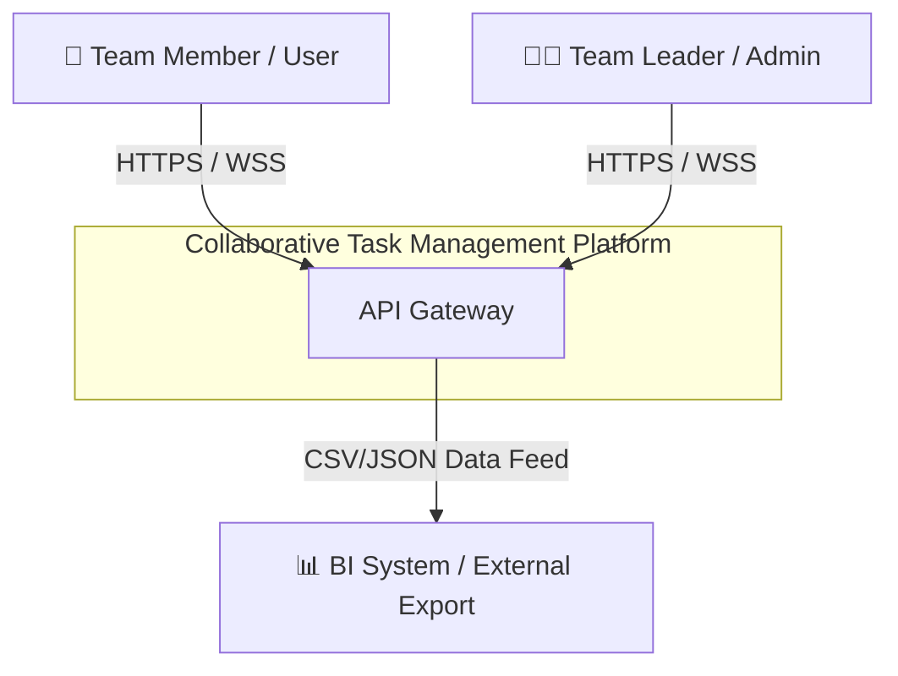
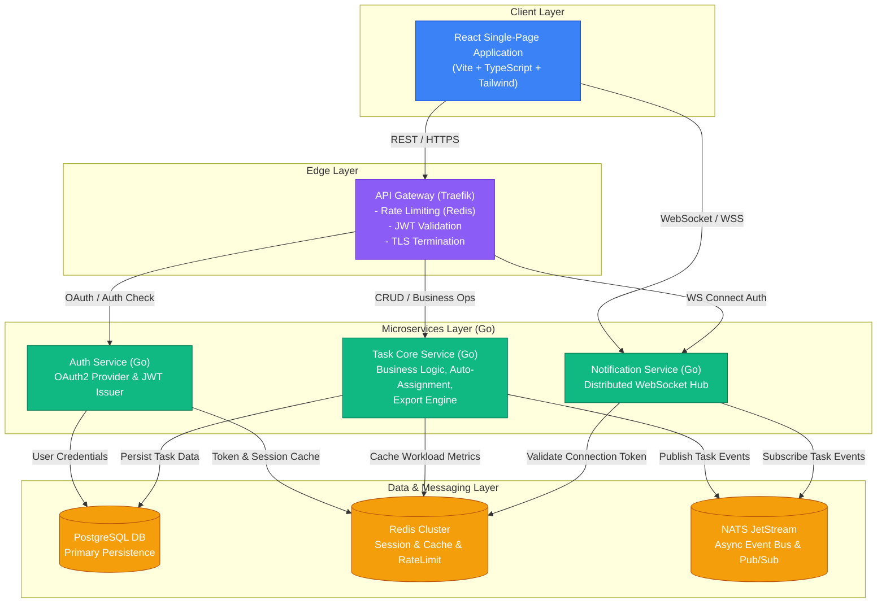

# Detailed Architectural Design Specifications
## Real-Time Collaborative Task Management System

---

## 1. System Overview and Architectural Goals

The system is a cloud-native platform for collaborative task management, designed for high concurrency, real-time response times, and high portability across managed Kubernetes cloud providers (such as AWS EKS, GCP GKE, Azure AKS).

### 1.1 Key Functional Requirements
- **Collaborative Task Management**: Create, update, and track task states with support for concurrent edits.
- **Automated Workload-Based Assignment**: Heuristic engine that automatically assigns tasks based on individual team workload scores.
- **Real-Time Push Notifications**: Instant notification delivery via persistent WebSocket connections.
- **Structured Data Export**: Asynchronous generation and streaming of JSON and CSV report files.

### 1.2 Non-Functional Requirements & SLA
- **Concurrency Capacity**: Guaranteed support for 100+ concurrent active users with minimal latency (< 100ms API, < 20ms WebSockets).
- **Target Uptime**: SLA 99.5% availability monthly.
- **Cloud Portability**: Infrastructure-as-Code (IaC) configuration using Terraform and Kubernetes templates.
- **Consistency & Conflict Management**: Optimistic locking using incremental versions on task updates.

---

## 2. C4 Architecture (Context & Containers)

### 2.1 C4 Level 1 - System Context



### 2.2 C4 Level 2 - Container Diagram



---

## 3. Detailed Services Specifications

### 3.1 API Gateway
- **TLS Termination**: HTTPS / WSS endpoints.
- **Auth Interceptor**: Validates incoming JWT tokens inside `Authorization: Bearer <JWT>` header.
- **Rate Limiting**: Token Bucket algorithm backed by Redis (max 100 req/min per user).
- **Dynamic Routing**: Dispatches requests to target microservices based on request path.

### 3.2 Authentication Service (OAuth2)
- OAuth2 provider supporting **Access Tokens** (JWT, 15-min lifetime) and **Refresh Tokens** (Redis cache, 7-day lifetime).
- Session tracking and token blacklisting via Redis.

### 3.3 Task Core Service (Task Core Service)
- **Optimistic Locking**: Prevents concurrent updates by verifying the `version` column inside UPDATE statements. Returns `HTTP 409 Conflict` if client holds an obsolete version.
- **Workload Scoring ($W_u$)**:
  $$W_u = \sum_{t \in \text{Tasks}(u)} \left( \text{StoryPoints}(t) \times \text{StatusWeight}(\text{Status}(t)) \right)$$
  using weights: In Progress (1.0), In Review (0.5), and To Do (0.25).
- **Asynchronous Queue-Based Exports**: Export requests publish events to NATS JetStream topic (`export.jobs`), which are consumed by a pool of Go background workers. This isolates long-running jobs from the main API thread.

---

## 4. Data Models & PostgreSQL Database Schema

```sql
-- Users Table
CREATE TABLE users (
    id UUID PRIMARY KEY DEFAULT uuid_generate_v4(),
    email VARCHAR(255) UNIQUE NOT NULL,
    full_name VARCHAR(150) NOT NULL,
    role VARCHAR(50) NOT NULL DEFAULT 'MEMBER',
    created_at TIMESTAMP WITH TIME ZONE DEFAULT CURRENT_TIMESTAMP
);

-- Tasks Table with Optimistic Locking version field
CREATE TABLE tasks (
    id UUID PRIMARY KEY DEFAULT uuid_generate_v4(),
    workspace_id UUID NOT NULL REFERENCES workspaces(id) ON DELETE CASCADE,
    title VARCHAR(255) NOT NULL,
    description TEXT,
    status VARCHAR(50) NOT NULL DEFAULT 'TODO',
    priority VARCHAR(20) NOT NULL DEFAULT 'MEDIUM',
    story_points INT NOT NULL DEFAULT 1,
    assignee_id UUID REFERENCES users(id) ON DELETE SET NULL,
    version INT NOT NULL DEFAULT 1,
    created_at TIMESTAMP WITH TIME ZONE DEFAULT CURRENT_TIMESTAMP,
    updated_at TIMESTAMP WITH TIME ZONE DEFAULT CURRENT_TIMESTAMP
);

-- Database indexes for workload query optimization
CREATE INDEX idx_tasks_workspace_status ON tasks(workspace_id, status);
CREATE INDEX idx_tasks_assignee_status ON tasks(assignee_id, status);
```

---

## 5. Secure Coding Practices & Hardening

### 5.1 SQL Injection Prevention in Go (`pgx`)
Interactions with the PostgreSQL database use parameterized query variables to prevent SQL injection vulnerabilities:
```go
// Example of version verification statement (Optimistic Lock)
query := `
    UPDATE tasks 
    SET status = $1, version = version + 1, updated_at = NOW() 
    WHERE id = $2 AND version = $3 
    RETURNING version;
`
err := r.db.QueryRow(ctx, query, newStatus, taskID, clientVersion).Scan(&newVersion)
```

### 5.2 Secure OAuth2 with PKCE
Support for PKCE (Proof Key for Code Exchange) to protect authorization code exchanges on public clients, preventing authorization code interception.

### 5.3 Gateway Hardening & Security Headers
All API responses append the recommended OWASP security headers:
- **Content-Security-Policy (CSP)**: `default-src 'self';`
- **X-Content-Type-Options**: `nosniff`
- **X-Frame-Options**: `DENY`
- **Strict-Transport-Security (HSTS)**: Active for HTTPS connections.
