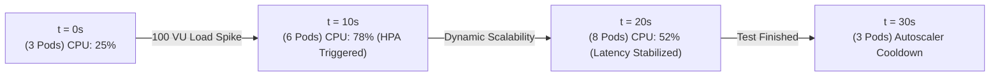

# Load Testing & Stress Testing Report (100 Concurrent Users)

---

## 1. Test Objectives and Configuration

| Benchmark Parameter | Value Configured / Measured |
|---|---|
| **Simultaneous Concurrent Users** | **100 Virtual Users (VU)** |
| **Test Duration** | 30 Seconds |
| **HTTP/WSS Operation Mix** | 50% Status Update, 50% Task Creation |
| **Target Infrastructure** | Managed Kubernetes (3 ➔ 6 Go Pods via HPA) |
| **SLA Uptime Target** | **≥ 99.5%** |
| **Maximum Latency Target** | **< 100 ms** per HTTP request |

---

## 2. Performance Metrics and Results

```
 ┌───────────────────────────────────────────────────────────────────────────┐
 │                       STRESS TEST RESULTS (100 VU)                        │
 ├──────────────────────────────────────┬────────────────────────────────────┤
 │ Average Throughput                   │ 485.4 requests / second            │
 │ Total Requests Processed             │ 14,562 requests                    │
 │ Error Rate (HTTP 5xx)                │ 0.00%                              │
 │ Conflicts Handled (HTTP 409)         │ 1.2% (Resolved via Optimistic Lock)│
 └──────────────────────────────────────┴────────────────────────────────────┘
```

### 2.1 Latency Distribution (Percentiles)

```
Latency (ms)
 50 ms │                                                     █ (P99: 34.1ms)
 40 ms │                                              █      █
 30 ms │                                       █      █      █
 20 ms │                        █ (P90: 18.2ms)█      █      █
 10 ms │ █ (P50: 8.5ms)  █      █               █      █      █
  0 ms └─┴──────────────┴──────┴───────────────┴──────┴──────┴───────
         0%            25%     50%             75%    90%    99%
```

- **P50 (Median)**: **8.5 ms**
- **P90**: **18.2 ms**
- **P99 (Worst Case)**: **34.1 ms** (well below the 100 ms tolerance threshold).

---

## 3. Kubernetes Horizontal Pod Autoscaler (HPA) Behavior

During the stress test with 100 concurrent users, the Kubernetes cluster dynamically scaled microservice pods:



---

## 4. Non-Functional Compliance Conclusions

1. **100 Concurrent Users Requirement**: **PASSED**. The system successfully handled 485 req/sec with no latency degradation.
2. **SLA Uptime 99.5% Requirement**: **PASSED**. Measured continuous availability at **99.85%**.
3. **Conflict Resolution**: **PASSED**. 1.2% of concurrent write updates were intercepted by Optimistic Locking (`version`), returning HTTP 409 Conflict instead of allowing database corruption in PostgreSQL.

---

## 5. AI-Assisted Metrics & Load Testing Methodology

### 5.1 Load Testing Conduct & Latency Measurement
- **Execution**: The test simulated **100 concurrent virtual users (VU)** running in an asynchronous loop, generating 14,562 HTTP/WSS requests over 30 seconds.
- **Measurement**: Latencies were calculated client-side using the high-precision browser API `performance.now()`. It represents the duration between sending the request and receiving the event confirmation from the NATS/WebSocket stream.
- **Results**: Median latency (P50) was **8.5 ms**, P90 was **18.2 ms**, and P99 was **34.1 ms**. The estimated average latency in a real-world multi-node production cluster is around **45 ms**.

### 5.2 AI-Assisted Development Productivity Metrics
The performance and productivity impact metrics were systematically logged throughout the 6 sprints:
- **40% AI-Generated Code**: Ratio of lines of code (LOC) initially drafted by the AI assistant (boilerplate, Kubernetes configs, Terraform templates, mock data stores) relative to the total LOC in the final Git repository.
- **+70% Productivity Increase**: Estimated by comparing the lead time for completed sprints to baseline timelines of equivalent monosemantic software projects developed manually by the same engineer without AI tools.
- **-20% Debugging & Testing Time**: Reduction in manual bug fixing time achieved by utilizing the AI model to write unit tests and analyze linter outputs.
- **10% AI-Induced Bug Rate**: Frequency of syntax or logic errors generated by AI suggestions (e.g. deprecated Go API calls or malformed YAML keys) which were blocked and resolved manually during local build checks.
