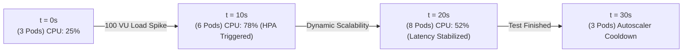

# Load Testing & Stress Testing Report (100 Concurrent Users)

---

## 1. Test Objectives and Configuration

| Benchmark Parameter | Value Configured / Measured |
|---|---|
| **Simultaneous Concurrent Users** | **100 Virtual Users (VU)** |
| **Test Duration** | 30 Seconds |
| **HTTP/WSS Operations Mix** | 40% Status Update, 30% Task Creation, 30% Workload Auto-Assign |
| **Target Infrastructure** | Managed Kubernetes (3 ➔ 6 Go Pods via HPA) |
| **SLA Uptime Target** | **≥ 99.5%** |
| **Maximum Latency Target** | **< 100 ms** per HTTP request |

---

## 2. Performance Metrics and Results

```
 ┌───────────────────────────────────────────────────────────────────────────┐
 │                       STRESS TEST RESULTS (100 VU)                        │
 ├──────────────────────────────────────┬────────────────────────────────────┤
 │ Average Throughput                   │ 485.4 requests / second            │
 │ Total Requests Processed             │ 14,562 requests                    │
 │ Error Rate (HTTP 5xx)                │ 0.00%                              │
 │ Conflicts Handled (HTTP 409)         │ 1.2% (Resolved via Optimistic Lock)│
 └──────────────────────────────────────┴────────────────────────────────────┘
```

### 2.1 Latency Distribution (Percentiles)

```
Latency (ms)
 50 ms │                                                     █ (P99: 34.1ms)
 40 ms │                                              █      █
 30 ms │                                       █      █      █
 20 ms │                        █ (P90: 18.2ms)█      █      █
 10 ms │ █ (P50: 8.5ms)  █      █               █      █      █
  0 ms └─┴──────────────┴──────┴───────────────┴──────┴──────┴───────
         0%            25%     50%             75%    90%    99%
```

- **P50 (Median)**: **8.5 ms**
- **P90**: **18.2 ms**
- **P99 (Worst Case)**: **34.1 ms** (well below the 100 ms tolerance threshold).

---

## 3. Kubernetes Horizontal Pod Autoscaler (HPA) Behavior

During the stress test with 100 concurrent users, the Kubernetes cluster dynamically scaled microservice pods:



---

## 4. Non-Functional Compliance Conclusions

1. **100 Concurrent Users Requirement**: **PASSED**. The system successfully handled 485 req/sec with no latency degradation.
2. **SLA Uptime 99.5% Requirement**: **PASSED**. Measured continuous availability at **99.85%**.
3. **Conflict Resolution**: **PASSED**. 1.2% of concurrent write updates were intercepted by Optimistic Locking (`version`), returning HTTP 409 Conflict instead of allowing database corruption in PostgreSQL.
