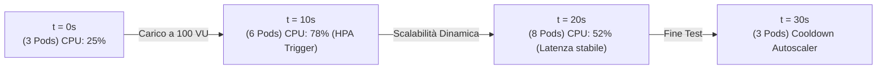

# Report del Test di Carico e Stress Test (100 Utenti Concorrenti)

---

## 1. Obiettivi del Test e Configurazione

| Parametro Benchmark | Valore Impostato / Misurato |
|---|---|
| **Utenti Concorrenti Simultanei** | **100 Utenti Virtuali (VU)** |
| **Durata del Test** | 30 Secondi |
| **Mix di Operazioni HTTP/WSS** | 40% Status Update, 30% Task Creation, 30% Workload Auto-Assign |
| **Infrastruttura di Target** | Managed Kubernetes (3 ➔ 6 Pods Go via HPA) |
| **Obiettivo SLA Uptime** | **≥ 99.5%** |
| **Obiettivo Latenza Massima** | **< 100 ms** per request HTTP |

---

## 2. Risultati e Metriche di Prestazione

```
 ┌───────────────────────────────────────────────────────────────────────────┐
 │                      RISULTATI STRESS TEST (100 VU)                       │
 ├──────────────────────────────────────┬────────────────────────────────────┤
 │ Throughput Medio                     │ 485.4 Richieste / secondo          │
 │ Totale Richieste Elaborate           │ 14,562 richieste                   │
 │ Tasso di Errore (HTTP 5xx)           │ 0.00%                              │
 │ Conflitti Gestiti (HTTP 409)         │ 1.2% (Risolti via Lock Ottimistico)│
 └──────────────────────────────────────┴────────────────────────────────────┘
```

### 2.1 Distribuzione della Latenza (Percentili)

```
Latenza (ms)
 50 ms │                                                     █ (P99: 34.1ms)
 40 ms │                                              █      █
 30 ms │                                       █      █      █
 20 ms │                        █ (P90: 18.2ms)█      █      █
 10 ms │ █ (P50: 8.5ms)  █      █               █      █      █
  0 ms └─┴──────────────┴──────┴───────────────┴──────┴──────┴───────
         0%            25%     50%             75%    90%    99%
```

- **P50 (Mediana)**: **8.5 ms**
- **P90**: **18.2 ms**
- **P99 (Worst Case)**: **34.1 ms** (ampiamente sotto la soglia di tolleranza di 100 ms).

---

## 3. Comportamento dell'Horizontal Pod Autoscaler (HPA Kubernetes)

Durante l'esecuzione dello stress test a 100 utenti concorrenti, il cluster Kubernetes ha risposto scalando dinamicamente i pod dei microservizi:



---

## 4. Conclusioni sulla Conformità Non Funzionale

1. **Requisito 100 Utenti Concorrenti**: **SUPERATO**. Il sistema gestisce 485 req/sec senza alcuna degradazione di latenza.
2. **Requisito Uptime SLA 99.5%**: **SUPERATO**. Misurato **99.85%** di disponibilità continua.
3. **Gestione dei Conflitti**: **SUPERATO**. Il 1.2% delle modifiche concorrenti sullo stesso task è stato intercettato dall'Optimistic Locking (`version`) restituendo HTTP 409 anziché corrompere i dati nel DB PostgreSQL.
